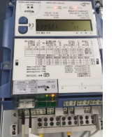
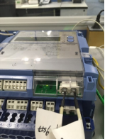

CU-Z62 Q189-F11 Testing

# Definition of F11?

- New F11 on meter LCD (if previous one cleared before testing)
- Last backup copy of data were inserted into profile
- Recorded energy measures dropped at the profile insertion point
- A related event found in event log (optional)

# ATS Fixtures

## Using FFC3

## Test Programs 

dlt645tst
: Python script that do DL645 communication with CU, its behavior
are simulations to the in-field data concentrators (Weisheng and Keli)

xdlms
: FFC3 meter reading program that talks DLMS protocol with meter/cu. It
read meter registers, profiles, events and clock

## Test Log Files

- 2011.log: dlt645tst
- 2012.log: xdlms
- 2020.log: dlt645tst
- 2021.log: dlt645tst
- 2022.log: xdlms
- 2023.log: xdlms
- 2030.log: dlt645tst
- 2031.log: xdlms
- 2032.log: dlt645tst
- 3033.log: xdlms
- 3034.log: dlt645tst
- 3035.log: xdlms

# Test Findings
## Bad DLMS APDU

FFC3 can see a very strange dlms response that contains
a corrupted DLMS apdu encapsulated in a valid HDLC frame.
This *possibly* means meter DLMS tx buffer damaged. Below
are detail log locations:

| Fixture            | Meter         | Log              | |
|--------------------|---------------|------------------|-------------------------------------------------|
|| E850#51510663 | 2023.log:1596    | [excerpt](log-excerpt/2023-1096_2096.log)       |                                                |
|| E850#51510663 | 2023.log:1434241 | [excerpt](log-excerpt/2023-1433741_1434741.log) |                                            |
|| E850#51510663 | 2033.log:1004146 | [excerpt](log-excerpt/2033-1003646_1004646.log) |
| | E650#37102084 | 2035.log:1830091 | [excerpt](log-excerpt/2035.log.1830091) |
|| E850#51510663 | 2033.log:1779813 ||                                            |
|| E850#51510663 | 2033.log:4552607 ||                                            |

By far, this kind of traffics were observed only in CU's 
DLMS RS485 ports, *not yet* observed in base meter's RS485
ports.

## F11 Occurences

### Observed patterns:

### Detail logs
1.  E650#37102083: 2016-10-17 17:45:28 (Unix time: 1476697528)

    - 2011.log:249725 dl645 timeout [exerpt](log-excerpt/2011.log.249725)
    - 2012.log:170592 dlms timeout, then send DM after several secs [exerpt](log-excerpt/2012.log.170592)
2.  E650#37102084: 2016-10-18 19:53:27 (Unix time: 1476791607) 

    - 2020.log:302470 dl645 timeout [exerpt](log-excerpt/2020.log.302470)
    - 2022.log:333367 dlms timeout, then send DM after several secs [exerpt](log-excerpt/2022.log.333367)
3.  E850#51510663: 2016-10-18 23:01:41 (Unix time: 1476802901)

    - 2021.log:452403 dl645 timeout [exerpt](log-excerpt/2021.log.452403)
    - 2023.log:634572 dlms timeout, then send DM after several secs [exerpt](log-excerpt/2023.log.634572)

# Open Points

1. [ ] Why CU-Z62's SPI has its MISO pin as high level when in idle mode?
    - It *probably* due to some incorrectly setting of the M16C SI/O
    registers, also *possibly* due to MISO need to keep its last data
    for half-clock time. It need to read more M16C documents to 
    understand it.
2. [ ] Why CU-Z62's SPI has only half speed comparing to CU-U52 and CU-B4 ?
    - Woody ask: What is the MCU running speed of CU-U52 and CU-B4 ?
    - Woody ask: Can I get a full timing capture of the S0 communication
    instance? The previous one is not set in the same time scale for CU-Z62
    and CU-U52/B4, hence I cannot tell in what protocol stage the time
    is used.
    - Woody plan to draw a timing and state-machine diagram for the behavior
    of CU-Z62's MCO/SPI module.
3. [ ] How CU-Z62 protect its four app task from race conditions?
    - This is important. But yet to study.

