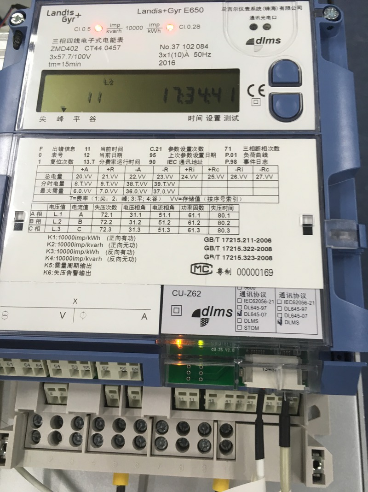
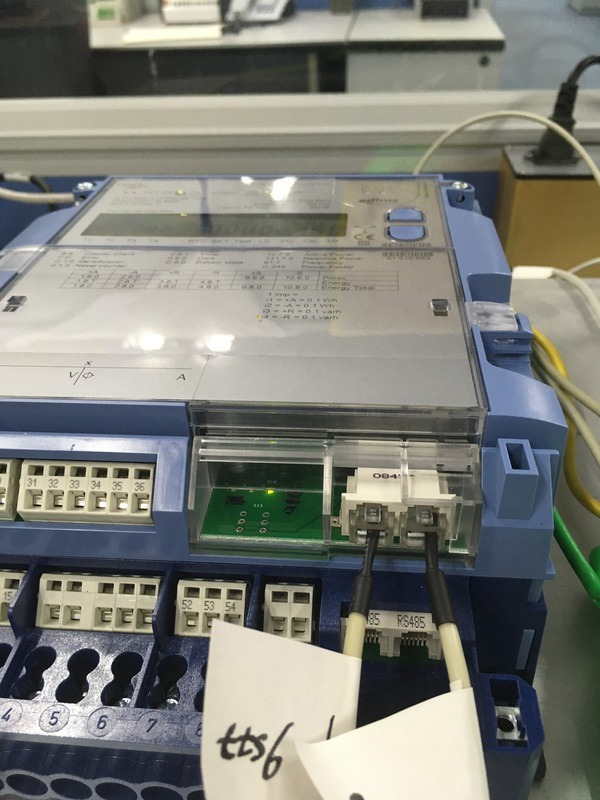

CU-Z62 Q189-F11 Testing

# Definition of F11?

- New F11 on meter LCD (if previous one cleared before testing)
- Last backup copy of data were inserted into profile
- Recorded energy measures dropped at the profile insertion point
- A related event found in event log (optional)

# ATS Fixtures

## Using FFC3

| Setup  | Wiring                   | Setup | Wiring | Setup | Wiring |
|--------|--------------------------|-------|--------|-------|--------|
| Red    |   | Blue |   | Green |  | 

## Test Programs 

dlt645tst
: Python script that do DL645 communication with CU, its behavior
are simulations to the in-field data concentrators (Weisheng and Keli)

xdlms
: FFC3 meter reading program that talks DLMS protocol with meter/cu. It
read meter registers, profiles, events and clock

# Test Findings
## Bad DLMS APDU

FFC3 can see a very strange dlms response that contains
a corrupted DLMS apdu encapsulated in a valid HDLC frame.
This *possibly* means meter DLMS tx buffer damaged. Below
are detail log locations:

| Fixture            | Meter         | Log              |
|--------------------|---------------|------------------|
|| E850#51510663 | [2023.log:1596](log-excerpt/2023-1096_2096.log)       |                                                |
|| E850#51510663 | [2023.log:1434241](log-excerpt/2023-1433741_1434741.log) |                                            |
|| E850#51510663 | [2033.log:1004146](log-excerpt/2033-1003646_1004646.log) |
| | E650#37102084 | [2035.log:1830091](log-excerpt/2035.log.1830091) |
|| E850#51510663 | 2033.log:1779813 |
|| E850#51510663 | 2033.log:4552607 |

By far, this kind of traffics were observed only in CU's 
DLMS RS485 ports, *not yet* observed in base meter's RS485
ports.

## F11 Occurences

### Communication Failure Pattern (CFP):

-  E650#37102083

    |time                           | dlms log                                            | dl645 log                                        |
    |-------------------------------|-----------------------------------------------------|--------------------------------------------------|
    |16-10-17 17:45:28 (1476697528) | [2012.log:170592](log-excerpt/2012.log.170592) | [2011.log:249725](log-excerpt/2011.log.249725)   |

-  E650#37102084

    |time                           | dlms log                                            | dl645 log                                        |
    |-------------------------------|-----------------------------------------------------|--------------------------------------------------|
    |16-10-18 19:53:27 (1476791607) | [2022.log:333367](log-excerpt/2022.log.333367)      | [2020.log:302470](log-excerpt/2020.log.302470)   |

-  E850#51510663

    |time                           | dlms log                                            | dl645 log                                        |
    |-------------------------------|-----------------------------------------------------|--------------------------------------------------|
    |16-10-18 23:01:41 (1476802901) | [2023.log:634572](log-excerpt/2023.log.634572)      | [2021.log:452403](log-excerpt/2021.log.452403)   |
    |16-10-23 03:04:18 +8s          | [2033.log:8090927](log-excerpt/2033:8090927.log)    | [2032.log:3407353](log-excerpt/2032:3407353.log) |
    |16-10-24 01:13:11 +9s          | [2033.log:10614842](log-excerpt/2033:10614842.log)  | [2032.log:4265436](log-excerpt/2032:4265436.log) |

### Communication Failure W/O F11

It was observed there exists exactly same CFP as above, but **no**
a F11 found in meter:

-  E850#51510663

    |time                   | dlms log                  | dl645 log           |
    |-----------------------|---------------------------|---------------------|
    |16-10-20 15:12:06 +8s  | [2033.log:2046807](log-excerpt/2033:2046807.log)   | [2032.log:966002](log-excerpt/2032:966002.log)   |
    |16-10-21 19:02:19 +16s | [2033.log:4573240](log-excerpt/2033:4573240.log)   | [2032.log:2147824](log-excerpt/2032:4573240.log) |
    |16-10-22 03:00:27 +16s | [2033.log:5363596](log-excerpt/2033:5363596.log)   | [2032.log:2474030](log-excerpt/2032:5363596.log) |
    |16-10-23 04:37:30 +16s | [2033.log:8281462](log-excerpt/2033:8281462.log)   | [2032.log:3467705](log-excerpt/2032:3467705.log) |
    |16-10-23 22:48:30 +16s | [2033.log:10348125](log-excerpt/2033:10348125.log) | [2032.log:4171891](log-excerpt/2032:4171891.log) |

-  E650#37102084 (Red)

    |time                   | dlms log                  | dl645 log           |
    |-----------------------|---------------------------|---------------------|
    |16-10-21 08:46:59 +16s | [2035.log:3711512](log-excerpt/2035:3711512.log) | [2034.log:1750664](log-excerpt/2034:1750664.log) |
    |16-10-21 15:42:20 +8s  | [2035.log:4350909](log-excerpt/2035:4350909.log) | [2034.log:2051204](log-excerpt/2034:2051204.log) |
    |16-10-22 08:57:42 +16s | [2035.log:6146271](log-excerpt/2035:6146271.log) | [2034.log:2767292](log-excerpt/2034:2767292.log) |
    |16-10-22 13:54:49 +16s | [2035.log:6713299](log-excerpt/2035:6713299.log) | [2034.log:2963941](log-excerpt/2034:2963941.log) |

**Note** In the event of '16-10-21 15:42:20', the meter recorded a pair of 
normal power down/up events, the duration is about 8s , but no one 
actually power down it.

# Open Points

1. [ ] Why CU-Z62's SPI has its MISO pin as high level when in idle mode?
    - It *probably* due to some incorrectly setting of the M16C SI/O
    registers, also *possibly* due to MISO need to keep its last data
    for half-clock time. It need to read more M16C documents to 
    understand it.
2. [ ] Why CU-Z62's SPI has only half speed comparing to CU-U52 and CU-B4 ?
    - Woody ask: What is the MCU running speed of CU-U52 and CU-B4 ?
    - Woody ask: Can I get a full timing capture of the S0 communication
    instance? The previous one is not set in the same time scale for CU-Z62
    and CU-U52/B4, hence I cannot tell in what protocol stage the time
    is used.
    - Woody plan to draw a timing and state-machine diagram for the behavior
    of CU-Z62's MCO/SPI module.
3. [ ] How CU-Z62 protect its four app task from race conditions?
    - This is important. But yet to study.
4. [ ] In what situation, a CU can be reset by meter?
5. [ ] How the corrupted DLMS Apdu was generated? By CU or by meter?

